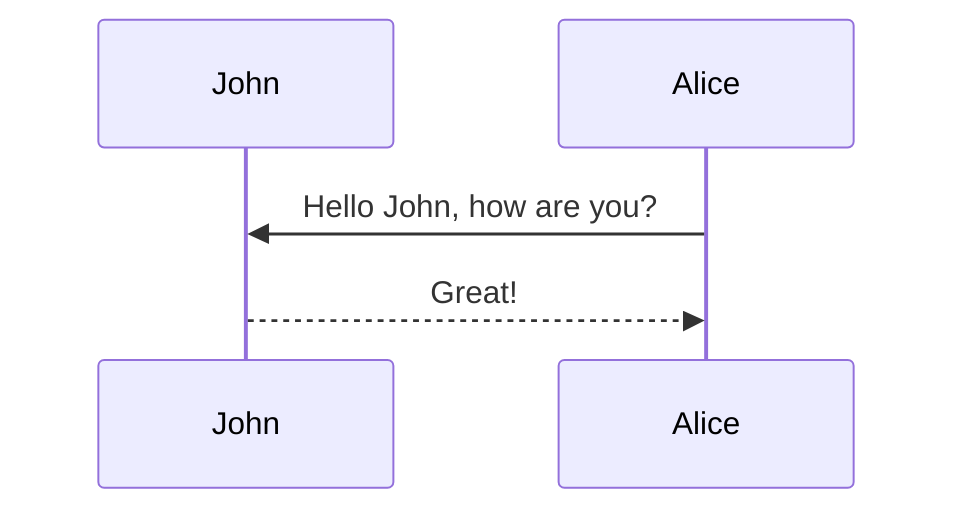

## 链接
[Pinterest](https://www.pinterest.com)

<a href="https://en.wikipedia.org/wiki/Cold-pressed_juice">cold-pressed</a>

## 列表
- brunch
- fixie
- raybans
- messenger bag

## Check List
- [x] Brush Teeth
- [ ] Put on socks
  - [x] Put on left sock
  - [ ] Put on right sock
- [x] Go to school

## 分割线
<hr>


## 引用
> We do not grow absolutely, chronologically. We grow sometimes in one dimension, and not in another, unevenly. We grow partially. We are relative. We are mature in one realm, childish in another.
> —Anais Nin


## 图像
### 水平排布
<div class="row mt-3">
    <div class="col-sm mt-3 mt-md-0">
        
    </div>
    <div class="col-sm mt-3 mt-md-0">
        
    </div>
</div>
<div class="caption">
    A simple, elegant caption looks good between image rows, after each row, or doesn't have to be there at all.
</div>

### 缩放
<div class="row mt-3">
    <div class="col-sm mt-3 mt-md-0">
        
    </div>
    <div class="col-sm mt-3 mt-md-0">
        
    </div>
</div>

## 代码
### markdown
````markdown
```c++
code code code
```
````

```c++
int main(int argc, char const *argv[])
{
    string myString;

    cout << "input a string: ";
    getline(cin, myString);
    int length = myString.length();

    char charArray = new char * [length];

    charArray = myString;
    for(int i = 0; i < length; ++i){
        cout << charArray[i] << " ";
    }

    return 0;
}
```

### liquid

 <br/> code code code <br/> 





int main(int argc, char const *argv[])
{
string myString;

    cout << "input a string: ";
    getline(cin, myString);
    int length = myString.length();

    char charArray = new char * [length];

    charArray = myString;
    for(int i = 0; i < length; ++i){
        cout << charArray[i] << " ";
    }

    return 0;

}



## 公式
### 行内
...$$E = mc^2$$...

### 独立
$$
\sum_{k=1}^\infty |\langle x, e_k \rangle|^2 \leq \|x\|^2
$$

### 引用
\begin{equation}
\label{eq:cauchy-schwarz}
\left( \sum_{k=1}^n a_k b_k \right)^2 \leq \left( \sum_{k=1}^n a_k^2 \right) \left( \sum_{k=1}^n b_k^2 \right)
\end{equation}

refer to the equation using \eqref{eq:cauchy-schwarz}.

## mermaid



## 表格
### markdown

| Left aligned | Center aligned | Right aligned |
| :----------- | :------------: | ------------: |
| Left 1       |    center 1    |       right 1 |
| Left 2       |    center 2    |       right 2 |
| Left 3       |    center 3    |       right 3 |

### html
<table id="table" data-toggle="table" data-url="{{ '/assets/json/table_data.json' | relative_url }}">
  <thead>
    <tr>
      <th data-field="id">ID</th>
      <th data-field="name">Item Name</th>
      <th data-field="price">Item Price</th>
    </tr>
  </thead>
</table>

### bootstrap table
<table
  data-click-to-select="true"
  data-height="460"
  data-pagination="true"
  data-search="true"
  data-toggle="table"
  data-url="{{ '/assets/json/table_data.json' | relative_url }}">
  <thead>
    <tr>
      <th data-checkbox="true"></th>
      <th data-field="id" data-halign="left" data-align="center" data-sortable="true">ID</th>
      <th data-field="name" data-halign="center" data-align="right" data-sortable="true">Item Name</th>
      <th data-field="price" data-halign="right" data-align="left" data-sortable="true">Item Price</th>
    </tr>
  </thead>
</table>


## 视频
<div class="row mt-3">
    <div class="col-sm mt-3 mt-md-0">
        
    </div>
    <div class="col-sm mt-3 mt-md-0">
        
    </div>
</div>
<div class="caption">
    A simple, elegant caption looks good between video rows, after each row, or doesn't have to be there at all.
</div>

<div class="row mt-3">
    <div class="col-sm mt-3 mt-md-0">
        
    </div>
    <div class="col-sm mt-3 mt-md-0">
        
    </div>
</div>

## 音频

<div class="row mt-3">
    <div class="col-sm mt-3 mt-md-0">
        
    </div>
    <div class="col-sm mt-3 mt-md-0">
        
    </div>
</div>
<div class="caption">
    A simple, elegant caption looks good between video rows, after each row, or doesn't have to be there at all.
</div>

## 定制化引用

> ##### TIP
> A tip can be used when you want to give advice
> related to a certain content. 

> ##### TIP
> A tip can be used when you want to give advice
> related to a certain content.
{: .block-tip }

> ##### WARNING
> This is a warning, and thus should
> be used when you want to warn the user
{: .block-warning }

> ##### DANGER
> This is a danger zone, and thus should
> be used carefully
{: .block-danger }

## Jupyter Notebook

{::nomarkdown}



  

  <p>Sorry, the notebook you are looking for does not exist.</p>

{:/nomarkdown}

## Twitter
An example of displaying a tweet:


An example of pulling from a timeline:


## bibliography










Lorem ipsum dolor sit amet, consectetur adipisicing elit,
sed do eiusmod tempor.

Lorem ipsum dolor sit amet, consectetur adipisicing.


[distill style post]()